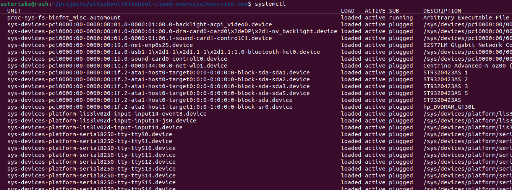
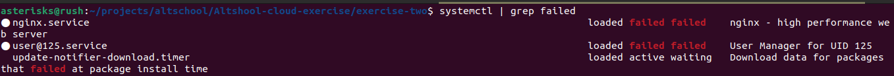
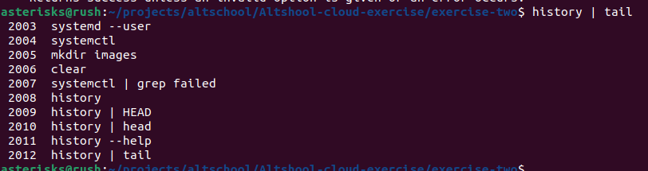
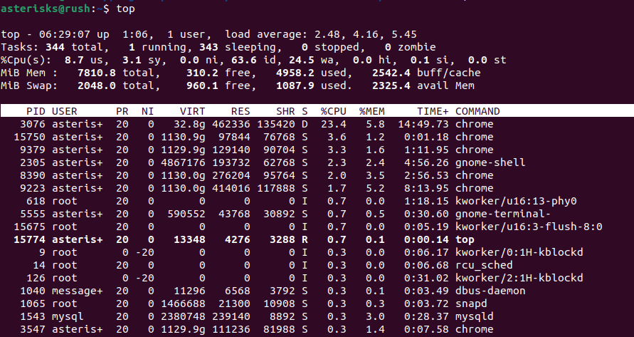
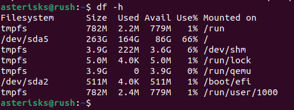
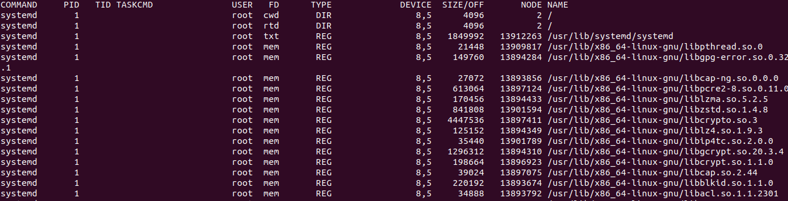
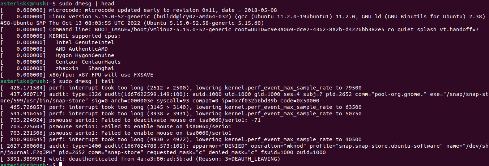
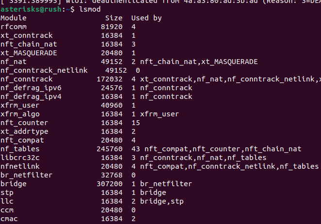
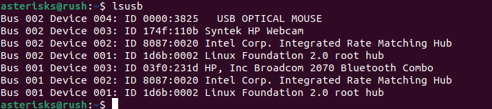

## 10 Linux Command

### Introduction


### Main

1. Systemctl Command
 
```
systemctl
```


2. Grep Command 

```
systemctl | grep failed
```


3. History Command

```
history
```


4. Man Command

```
man history
man man
```


5. Top Command

```
top
```


6. df Command

```
df -h
```


7. Lsof Command

```
lsof | less
```


8. Dmesg Command

```
sudo dmesg | less
sudo dmesg | head
```


9. Lsmod Command

```
lsmod
```


10. lsusb Command

```
lsusb
```


